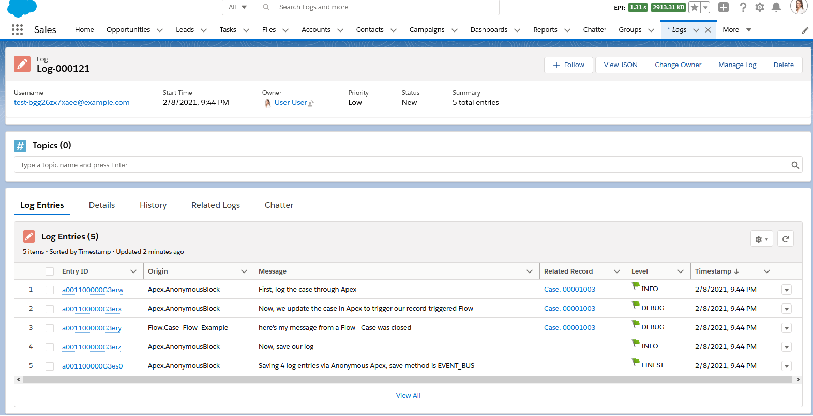
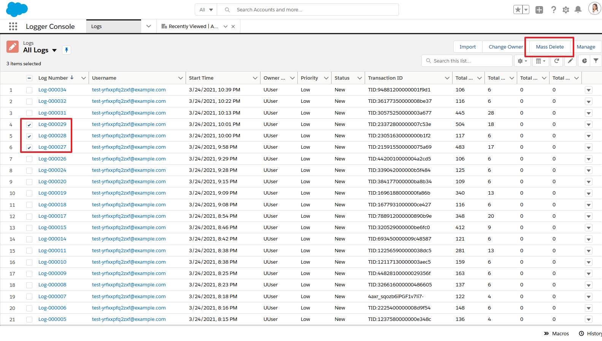
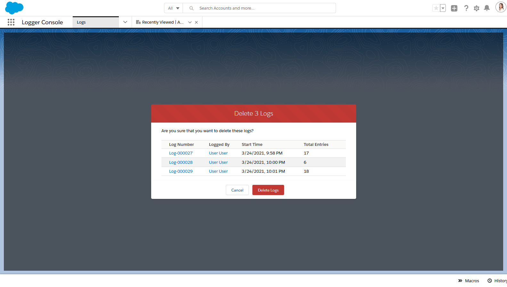

# Nebula Logger for Salesforce
[](https://github.com/jongpie/NebulaLogger/actions/workflows/deploy.yml)
[](https://codecov.io/gh/jongpie/NebulaLogger)

Designed for Salesforce admins, developers & architects. A robust logger for Apex, Flow, Process Builder & Integrations.

[](https://githubsfdeploy.herokuapp.com/?owner=jongpie&repo=NebulaLogger&ref=main)
[](https://login.salesforce.com/packaging/installPackage.apexp?p0=04t5Y000000YLDLQA4)
[](https://jongpie.github.io/NebulaLogger/)

## Features
1. Easily add log entries via Apex, Flow & Process Builder to generate 1 consolidate log
2. Manage & report on logging data using the `Log__c` and `LogEntry__c` objects
3. Leverage `LogEntryEvent__e` platform events for real-time monitoring & integrations
4. Enable logging and set the logging level for different users & profiles using `LoggerSettings__c` custom hierarchy setting
5. View related log entries on any record page by adding the 'Related Log Entries' component in App Builder
6. Dynamically assign Topics to `Log__c` and `LogEntry__c` records for tagging/labeling your logs (not currently available in the managed package)

## Installing

You can choose to either deploy the metadata from this repo to your org, or install the managed package. The metadata is the same, but there are some differences in using the 2 versions. All examples in README are for the unmanaged metadata - simply add the `Nebula` namespace from the examples if you are using the managed package.

|             | Unpackaged Metadata | 2nd Gen Managed Package |
| ----------- | ------------------- | ----------------------- |
| Namespace   | none                | `Nebula`                |
| Future Releases        | New enhancements & bugfixes will be immediately available in GitHub | Slower release cycle: new package versions will only be released once new enhancements & bugfixes have been tested and code is stabilized |
| Public Apex Methods        | Any `public` Apex methods are subject to change in the future - they can be used, but you may encounter deployment issues if future changes to `public` methods are not backwards-compatible | Only `global` methods are available in managed packages - any `global` Apex methods available in the managed package will be supported for the foreseeable future |
| Apex Debug Statements        | `System.debug()` is automatically called  | Requires adding your own calls for `System.debug()` due to Salesforce limitations with managed packages |
| Apex Stack Traces        | Automatically stored in `LogEntry__c.StackTrace__c` when calling methods like `Logger.debug('my message');` | Requires calling `parseStackTrace()` due to Salesforce limitations with managed packages. For example:<br />`Logger.debug('my message').parseStackTrace(new DmlException().getStackTrace());` |
| Assign Topics (Tagging/Labeling System) | Provide `List<String> topics` in Apex or Flow to dynamically assign Salesforce Topics to `Log__c` and `LogEntry__c` records | This functionality is not currently available in the managed package |

## Getting Started
After deploying Nebula Logger to your org, there are a few additional configuration changes needed...
* Assign permission set(s) to users
  * `LoggerLogCreator` provides the minimum access needed for users to generate logs via Apex, Flow or Process Builder
  * `LoggerEndUser` provides access to generate logs, as well as read-only access to any log records shared with the user.
  * `LoggerLogViewer` provides view-all access (read-only) to all log records. This does **not** provide access to generate logs.
  * `LoggerAdmin` provides view-all and modify-all access to all log records.
* Customize the default settings in `LoggerSettings__c`
  * You can customize settings at the org, profile and user levels
* Unmanaged Metadata Only: Enable Salesforce Topics for the `Log__c` and `LogEntry__c` objects for tagging/labeling. See [Salesforce Help](https://help.salesforce.com/articleView?id=sf.collab_topics_records_admin.htm) for more details.
  * Currently, enabling Topics for objects must still be done using the Salesforce Classic UI. Once enabled, Topics can then be used from withing Lightning Experience.
  * Once enabled, Topics can be added via Apex and Flow and then used as list view filters (and more) for the object  `Log__c`.


## Logger for Apex: Quick Start
For Apex developers, the `Logger` class has several methods that can be used to add entries with different logging levels. Each logging level's method has several overloads to support multiple parameters.

```java
// This will generate a debug statement within developer console
System.debug('Debug statement using native Apex');

// This will create a new `Log__c` record with multiple related `LogEntry__c` records
Logger.error('Add log entry using Nebula Logger with logging level == ERROR');
Logger.warn('Add log entry using Nebula Logger with logging level == WARN');
Logger.info('Add log entry using Nebula Logger with logging level == INFO');
Logger.debug('Add log entry using Nebula Logger with logging level == DEBUG');
Logger.fine('Add log entry using Nebula Logger with logging level == FINE');
Logger.finer('Add log entry using Nebula Logger with logging level == FINER');
Logger.finest('Add log entry using Nebula Logger with logging level == FINEST');
Logger.saveLog();
```

This results in 1 `Log__c` record with several related `LogEntry__c` records.


## Logger for Flow & Process Builder: Quick Start
Within Flow & Process Builder, you can select 1 of the several Logging actions


In this simple example, a Flow is configured after-insert and after-update to log a Case record (using the action 'Add Log Entry for an SObject Record')


This results in a `Log__c` record with related `LogEntry__c` records.


## All Together: Apex & Flow in One Log
After incorporating Logger into your Flows & Apex code (including controllers, trigger framework, etc.), you'll have a unified transaction log of all your declarative & custom code automations.

```java
Case currentCase = [SELECT Id, CaseNumber, Type, Status, IsClosed FROM Case LIMIT 1];

Logger.info('First, log the case through Apex', currentCase);

Logger.debug('Now, we update the case in Apex to cause our record-triggered Flow to run');
update currentCase;

Logger.info('Last, save our log');
Logger.saveLog();
```

This generates 1 consolidated `Log__c`, containing `LogEntry__c` records from both Apex and Flow



## Event-Driven Integrations with Platform Events
Logger is built using Salesforce's [Platform Events](https://developer.salesforce.com/docs/atlas.en-us.platform_events.meta/platform_events/platform_events_intro.htm), an event-driven messaging architecture. External integrations can subscribe to log events using the `LogEntryEvent__e` object - see more details at [the Platform Events Developer Guide site](https://developer.salesforce.com/docs/atlas.en-us.platform_events.meta/platform_events/platform_events_subscribe_cometd.htm)

## Managing Logs
To help development and support teams better manage logs (and any underlying code or config issues), some fields on `Log__c` are provided to track the owner, priority and status of a log. These fields are optional, but are helpful in critical environments (production, QA sandboxes, UAT sandboxes, etc.) for monitoring ongoing user activities.
* All editable fields on `Log__c` can be updated via the 'Manage Log' quick action (shown below)

  
* Additional fields are automatically set based on changes to `Log__c.Status__c`
  * `Log__c.ClosedBy__c` - The user who closed the log
  * `Log__c.ClosedDate__c` - The datetime that the log was closed
  * `Log__c.IsClosed__c` - Indicates if the log is closed, based on the selected status (and associated config in the 'Log Status' custom metadata type)
  * `Log__c.IsResolved__c` - Indicates if the log is resolved (meaning that it required analaysis/work, which has been completed). Only closed statuses can be considered resolved. This is also driven based on the selected status (and associated config in the 'Log Status' custom metadata type)
* To customize the statuses provided, simply update the picklist values for `Log__c.Status__c` and create/update corresponding records in the custom metadata type `LogStatus__mdt`. This custom metadata type controls which statuses are considerd closed and resolved.

## View Related Log Entries on a Record Page
Within App Builder, admins can add the 'Related Log Entries' lightning web component to any record page. Admins can also control which columns are displayed be creating & selecting a field set on `LogEntry__c` with the desired fields.
* The component automatically shows any related log entries, based on `LogEntry__c.RecordId__c == :recordId`
* Users can search the list of log entries for a particular record using the component's built-insearch box. The component dynamically searches all related log entries using SOSL.
* Component automatically enforces Salesforce's security model
  * Object-Level Security - Users without read access to `LogEntry__c` will not see the component
  * Record-Level Security - Users will only see records that have been shared with them
  * Field-Level Security - Users will only see the fields within the field set that they have access to


## Deleting Old Logs
Admins can easily delete old logs using 2 methods: list views or Apex batch jobs
### Mass Deleting with List Views
Salesforce (still) does not support mass deleting records out-of-the-box. There's been [an Idea for 11+ years](https://trailblazer.salesforce.com/ideaView?id=08730000000BqczAAC) about it, but it's still not standard functionality. A custom button is available on `Log__c` list views to provide mass deletion functionality.
1. Users can select 1 or more `Log__c` records from the list view to choose which logs will be deleted



2. The button shows a Visualforce page `LogMassDelete` to confirm that the user wants to delete the records



### Batch Deleting with Apex Jobs
Two Apex classes are provided out-of-the-box to handle automatically deleting old logs
1. `LogBatchPurger` - this batch Apex class will delete any `Log__c` records with `Log__c.LogRetentionDate__c <= System.today()`.
   * By default, this field is populated with "TODAY + 14 DAYS" - the number of days to retain a log can be customized in `LoggerSettings__c`.
   * Users can also manually edit this field to change the retention date - or set it to null to prevent the log from being automatically deleted
2. `LogBatchPurgeScheduler` - this schedulable Apex class can be schedule to run `LogBatchPurger` on a daily or weekly basis
