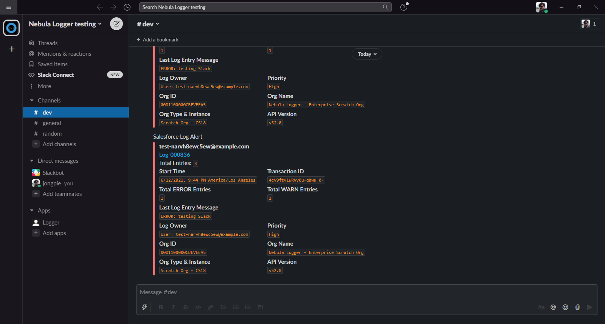
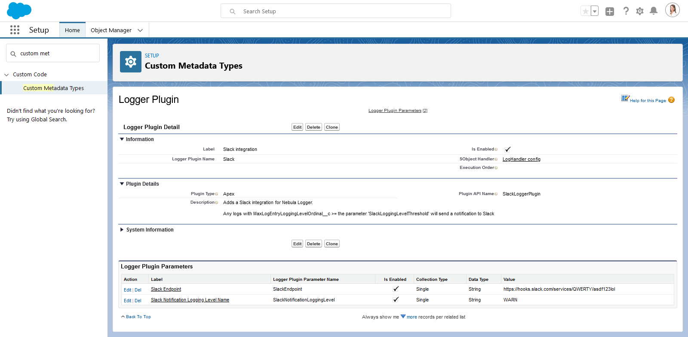

# Slack plugin for Nebula Logger

Adds a Slack integration for Nebula Logger. Any logs with log entries that meet a certain (configurable) logging level will automatically be posted to your Slack channel via an asynchronous `Queueable` job.

---

## What's Included

This plugin includes some add-on metadata for Logger to support the Slack integration

1. Apex class `SlackLoggerPlugin` and corresponding tests in `SlackLoggerPlugin_Tests`
2. Plugin configuration details stored in Logger's CMDT objects `LoggerSObjectHandlerPlugin__mdt` and `LoggerSObjectHandlerPluginParameter__mdt`
3. Custom fields `Log__c.SendSlackNotification__c` and `Log__c.SlackNotificationDate__c`
4. Field-level security (FLS) updates for the permission sets `LoggerAdmin` and `LoggerLogViewer` to provide access to the custom Slack fields
5. Custom list views for the `Log__c` and `LoggerSObjectHandlerPluginParameter__mdt` objects
6. Remote site setting for Slack's API

---

## Installation Steps

1. In Salesforce, ensure that you have the unlocked package version of Nebula Logger installed in your org.
2. In Salesforce, deploy the metadata for the Slack plugin for Logger. Currently, this has to be done by cloning/downloading the repo from GitHub and deploying yourself. An unlocked package will be released in the future to make this process much easier.
3. In Slack, create a new app in your Slack workspace and enable incoming webhooks for your app.
4. In Slack, create a new incoming webhook, and copy the webhook URL.
5. In Salesforce, go to Setup --> Custom Metadata Types --> Logger Plugin --> Slack (shown in screenshot below) and find the parameter 'Slack Endpoint'. Paste the Slack webhook URL into the `Value__c` field and save the Plugin Parameter record.
6. In Salesforce, set the desired logging level value for the Logger Plugin Parameter 'Slack Logging Level Threshold` (shown in screenshot below). It controls which logging level (ERROR, WARN, INFO, DEBUG, FINE, FINER OR FINEST) will trigger the Slack notifications to be sent.

At this point, the Slack integration should now be setup & working - any new logs that meet the threshold logging level (step 6 above) will send a Slack notification.

